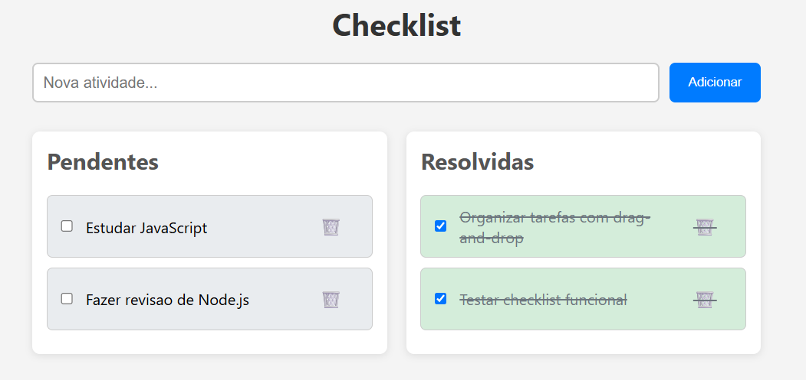
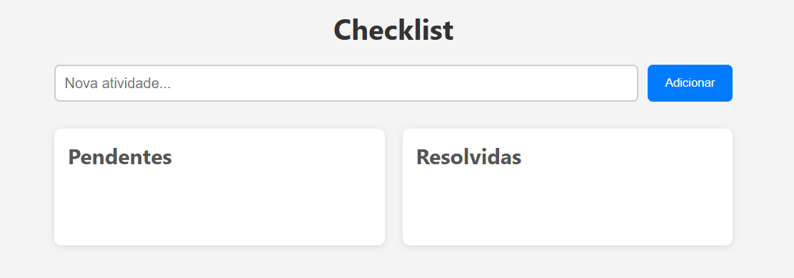

# ✅ Checklist App

Um aplicativo web simples e funcional de checklist com drag-and-drop para reordenar tarefas, desenvolvido com **Node.js**, **Express**, **MySQL** e **JavaScript Vanilla**.

---

## 🧰 Tecnologias Utilizadas

- **Frontend:** HTML5, CSS3, JavaScript (Vanilla)
- **Backend:** Node.js + Express
- **Banco de Dados:** MySQL
- **Outros:** Docker, Docker Compose

---

## 🚀 Funcionalidades

- Adicionar novas tarefas
- Marcar como resolvida ou pendente
- Excluir tarefas
- Reordenar tarefas com **drag-and-drop**
- Persistência automática da ordem no banco de dados
- Separação visual entre tarefas **pendentes** e **resolvidas**

---

## 📸 Demonstração

<div style="display: flex; align-items: center; gap: 8px; flex-direction: column;">
  <div>
  
  </div>
  <div>
  
  </div>
</div>

---

### 📁 Arquivo `.env`

#### Antes de rodar o projeto localmente, crie um arquivo .env na raiz com as variáveis de ambiente do banco de dados:

```env
DB_HOST=127.0.0.1
DB_USER=root
DB_PASSWORD=root
DB_NAME=checklist
DB_PORT=3308

- 🔐 Adicione .env ao seu .gitignore para evitar subir dados sensíveis ao Git.
```

## 📦 Como rodar o projeto localmente

### 🔧 Requisitos

- [Node.js](https://nodejs.org/)
- [Docker + Docker Compose](https://www.docker.com/)
- ou MySQL local configurado

---

### 💻 Passo a passo manual

```bash
# 1. Clone o projeto
  git clone https://github.com/seu-usuario/nome-do-repo.git
  cd nome-do-repo

# 2. Instale as dependências
  npm install

# 3. Configure o banco MySQL
  - Crie o banco de dados
  - Execute o script init.sql

# 4. Atualize suas credenciais no arquivo db.js

# 5. Inicie o servidor
node server.js
```

### 💻 Passo a passo Mysql Docker integrador (Opcional)

```bash
# Usando Docker (Docker precisa estar instalado)

1. Certifique-se de que o Docker e o Docker Compose estão instalados e em execução em sua máquina.

2. No diretório do projeto, execute o comando abaixo para iniciar todos os serviços (backend e banco de dados) via Docker Compose:

3. O ambiente será criado automaticamente, incluindo um container MySQL já configurado. Não é necessário instalar o MySQL localmente.

4. Para gerenciar o banco de dados de forma visual, utilize um cliente de sua preferência, como **TablePlus**, **DBeaver** ou **phpMyAdmin**.

5. Com um cliente gráfico, você pode visualizar, editar e administrar suas tabelas e dados de maneira mais prática do que apenas pelo terminal.

Pronto! O projeto estará rodando com o MySQL integrado via Docker.

```

### 🛠️ Estrutura do Projeto

```pgsql
📁 public/
├── index.html       → Página principal
├── script.js        → Lógica do frontend
├── styles.css       → Estilo do app

📄 server.js          → API com Express
📄 db.js              → Conexão com MySQL
📄 init.sql           → Script inicial para o banco de dados
📄 docker-compose.yml → Configuração do ambiente Docker(mySQL)

```

### 🧪 Exemplo da Tabela tasks

```sql
CREATE TABLE tasks (
  id INT AUTO_INCREMENT PRIMARY KEY,
  text VARCHAR(255) NOT NULL,
  completed BOOLEAN DEFAULT false,
  position INT
);

```
